# AudioZap

AudioZap is a containerized music platform integrating Bitcoin Lightning and Nostr. It features a decentralized relay for metadata, a Blossom server for media storage, and a Next.js dashboard for management.

The core problem we're solving is the friction and intermediation in music streaming. AudioZap enables:

- Direct-to-Artist Payments: "Zaps" settle instantly via LND, bypassing traditional aggregators.

- Protocol-Level Revenue Splits: We use a custom Khatru relay to enforce logic where splits (e.g., 90% Artist / 10% Platform or Producer) are validated before the content is even accepted by the network.

- Sovereign Identity: Artists own their audience via Nostr keys, removing platform lock-in.
  
The infrastructure should serve to offere an decentralized alternative to music distribution and monetization.

- Studios-Radios as Nodes: home studios, recording facilities, and local radio stations run their own physical nodes (Or containerized servers). They become the sovereign music infrastructure, hosting the content that is created locally, facilitating decentralized distribution and enabling direct-2-artist payments.

- Immutable Splits at Creation: The production team (artist, producer, engineer) agrees on revenue terms during the creation process. These terms are cryptographically signed into the metadata upon upload. The "contract" is code, enabling instant, trustless settlement via LND every time a track is played or zapped. Incentive mechanisms and contracts can be set at song lever with specific broadcastesr or players/clients.

# Rationale

If this models gets going and is adopted, the overall music industry and specailly the creative part will benefit. New business models would be possible.
If this models adopted by the Music industry, a whole generation will be immediately onboarded in  

The core problem we're solving is the friction and intermediation in music streaming. AudioZap enables:


## Overview

```mermaid
graph TD
    direction TB

    %% SUBGRAPH: STUDIO LEVEL
    subgraph Studio_Environment ["🎹 Production (Artists, Producers, Mixers)"]
        direction LR
        Artist_Phone["📱 Artist Phone <br/>(NIP-46 Signer)"]
        Studio_PC["🖥️ Studio Desktop <br/>(Contracting SW)"]
        Mixer_PC["🎧 Remixer Desktop <br/>(Derivative Work)"]
       
        Artist_Phone -- "1 Signs Splits" --> Studio_PC
        Studio_PC -- "2 Uploads Master" --> Blossom["💾 Blossom Server <br/>(Media Storage)"]
        Studio_PC -- "3 Publishes Track <br/>(Kind 31337)" --> Studio_Relay
       
        Mixer_PC -- "4 References Parent" --> Studio_PC
        Mixer_PC -- "5 Signs Remix Split" --> Studio_Relay
    end
    %% SUBGRAPH: FEDERATION LAYER
    subgraph Federation_Mesh ["🕸️ The Relay Mesh (Distribution & Governance)"]
        direction LR
        Studio_Relay["💎 Studio Relay <br/>(Khatru Framework)"]
        Radio_Relay["📡 Broadcaster Relay <br/>(Radio/Station Node)"]
        Archive_Relay["🏛️ Archive Relay <br/>(Global Catalog)"]
       
        Studio_Relay <-->|"Gossip (Sync)"| Radio_Relay
        Radio_Relay <-->|"Gossip (Sync)"| Archive_Relay
        Archive_Relay <-->|"Gossip (Sync)"| Studio_Relay
        Radio_Relay -- "6 Pays-Per-Play ⚡" --> Artist_Lightning
    end
    %% SUBGRAPH: USER EXPERIENCE
    subgraph User_Environment ["🎧 Fan & Listener Environment"]
        direction LR
        Player_App["📱 Music vSocial Player <br/>(React Native)"]
        User_Wallet["⚡ Lightning Wallet <br/>(NWC / Alby / Zeus)"]
       
        Player_App -- "7 Discover & Follow" --> Radio_Relay
        Player_App -- "Follow Artists (Nostr)" --> Radio_Relay
        Player_App -- "8 Stream Content" --> Blossom
        Player_App -- "9 Zap Tip / Comment" --> User_Wallet
    end
    %% PAYMENT FLOW - THE REVENUE SPLIT
    User_Wallet -- "10 Direct Zap Split ⚡" --> Artist_Lightning["💰 Artist Wallet"]
    User_Wallet -- "10 Direct Zap Split ⚡" --> Producer_Lightning["💰 Producer Wallet"]
    User_Wallet -- "10 Direct Zap Split ⚡" --> Mixer_Wallet["💰 Remixer Wallet"]
    User_Wallet -- "10 Platform Fee 2.1%" --> Platform_Wallet["🏦 Federation Treasury"]
    %% BROADCASTER INCENTIVES LOOP
    Radio_Relay -.->|"Hosting / Routing Rewards ⚡<br/>(Earn for sustaining mesh)"| Broadcaster_Wallet["💰 Broadcaster Wallet"]
    %% STYLING
    style Studio_Environment fill:#fdf2f8,stroke:#be185d,stroke-width:2px
    style Federation_Mesh fill:#eff6ff,stroke:#1d4ed8,stroke-width:2px
    style User_Environment fill:#f0fdf4,stroke:#15803d,stroke-width:2px
    style Platform_Wallet fill:#fff7ed,stroke:#c2410c,stroke-width:2px,stroke-dasharray: 5 5
    style Broadcaster_Wallet fill:#fff7ed,stroke:#c2410c,stroke-width:2px,stroke-dasharray: 5 5

```





## Project Structure

The project is organized into several key components, all managed via Docker:

- **LND**: The Lightning Network node (Bitcoin Testnet, Neutrino mode).
- **LNBits**: Wallet management UI and API, integrated with LND.
- **Blossom Server**: A Blossom-compatible server for decentralized media storage.
- **Khatru Relay**: A custom Nostr relay for metadata and social events.
- **AudioZap Dashboard**: A Next.js web application for interacting with the platform.

### Directory Layout

```text
.
├── audiozap-next/        # Next.js Dashboard source code
├── blossom/              # Blossom server configuration/source
├── blossom_data/         # Persistent data for Blossom
├── khatru-relay/         # Custom Nostr relay (Go-based)
├── lnbits_data/          # Persistent data for LNBits
├── lnd/                  # LND configuration
├── lnd_data/             # Persistent data for LND
├── relay_db/             # Persistent data for the Nostr relay
└── docker-compose.yml    # Main orchestration file
```

## Services & Ports

| Service | Port | Description |
|---------|------|-------------|
| **LND** | `10009` (gRPC), `8080` (REST) | Lightning Network Node |
| **LNBits** | `5000` | Wallet UI and Multi-custodial API |
| **Blossom** | `3000` | Media Storage Server |
| **Dashboard** | `3001` | Front-end Dashboard (Proxied to internal port 3000) |
| **Relay** | `3334` | Nostr Metadata Relay |

temp - lThe external IP address for this server is 34.35.7.115.
For internal networking, the server's private IP address on the primary interface (ens4) is 10.218.0.2

## Getting Started

0. **Ensure you can connect to the server**
   ```bash
   ssh root@3IP
   ```
   if not - gcloud compute config-ssh (to let glcoud terminal to handle the IAM)

1. **Launch the services**:
   ```bash
   docker compose up -d
   ```

## Accessing the Platform

### Local Access
If you are running this on your local machine:
- **Dashboard**: [http://localhost:3001](http://localhost:3001)
- **LNBits**: [http://localhost:5000](http://localhost:5000)

### External Access (Cloud)
If accessing via the external IP :
- **Dashboard**: [http://external IP:3001]
- **LNBits**: [http://external IP:5000]
- **Blossom**: [http://external IP:3000]
- **Relay**: `ws://external IP:3334`

> [!IMPORTANT]
> Ensure that ports `3000, 3001, 3334, 5000, 8080, 9735, 10009` are open in your Cloud Firewall (VPC Firewall Rules) for the instance.


## Development

- **Dashboard**: Source in `audiozap-next/`. Rebuild after changes.
- **Relay**: Source in `khatru-relay/`. Custom Go implementation using Khatru.
- **Blossom**: Standard Blossom server implementation.

---
*Created by [D.Leston]
(https://x.com/df_leston)
Nostr - npub1teprpsvpu8px6vqg4f4d7v5wz968yxkpw0yyr0q52m09ng48p2fq0h53xe
